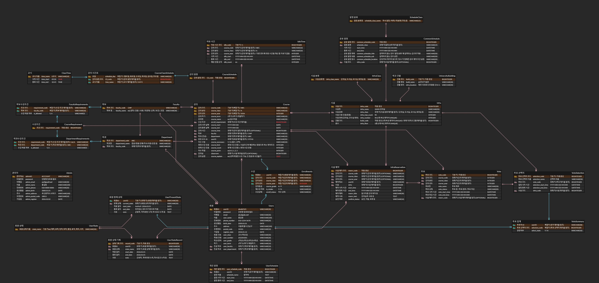

# DB 설계

- 전체 ERD

- 회원 테이블 (Users) 필요 논의 사항
    - 복수전공 / 부전공 처리 방식 (복수전공 OR 부전공을 합해 3개인 경우까지 고려)
        - 추후 확장 시 지원하기로 결정 (고려할 부분이 많고 도메인에 대한 이해가 부족)
    - 학번/교번 처리 방식
    - 관리자 테이블은 따로 분리

| 필드명 (논리명) | 키 여부 | 비고 |
| --- | --- | --- |
| userID (회원ID) | 기본 키 | ex) abcdef123 |
| password (비밀번호) | X | ex) abc123!@(암호화) |
| email (이메일) | X | ex) abcd@abc.def |
| user_name (이름) | X | ex) 홍길동 |
| phone_number (전화번호) | X | ex) 010-1234-5678 |
| birth_date (생년월일) | X | ex) 2000.01.01 생년 월일은 현재 시간 이후를 입력할 수 없음 |
| address (주소) | X | 서울특별시 강남구 |
| postal_code (우편번호) | X | ex) 10101 |
| register_date (가입일) | X | ex) 2026.01.12 가입일은 현재 시간보다 이후로만 입력이 가능하도록 조건 체크 (가입일이 잘못 입력되는 경우 방지) |
| user_class (회원 구분) | X | ex) 교수/학생 등 |
| user_number (학번/교번) | X | 입학(입사)년도+학과번호+임의번호로 저장되는 방식 substring으로 입학년도+학과번호가 정상적으로 입력되었는지 검사 |
| user_grade (학년/연차) | X | 1학년 / 2학년 / 3학년 / 4학년 |
| user_term (학기) | X | 1학기 / 2학기 / 계절학기 |
| user_faculty (전공 학부) | 외래 키 (학부 테이블 참조) | 필수 (NotNull) |
| user_department (전공 학과) | 외래 키 (학과 테이블 참조) | 필수 (NotNull) |

- 개인 일정 테이블 (UserSchedule)
    - 회원의 개인 일정을 저장
    - 회원의 개인 일정은 공유하지 않는다고 가정!
    - 캘린더 앱을 사용하는 겸 학교 시스템을 이용하는 방식으로 생각
    - 개인 일정은 투표 여유 시간에 사용되지 않도록 함
        - 즉, 개인 일정은 철저히 개인의 일정을 확인하는 용도로만 제한
        - 개인 일정은 단순히 일정을 보기 위한 기능! (단순 추가 기능)
        - 크게 사용되지 않을 것으로 예상 중 (추후 기능 업데이트?)

| 필드명 (논리명) | 키 여부 | 비고 |
| --- | --- | --- |
| user_schedule_code (개인 일정 코드) | 기본 키 | 자동 생성 |
| userID (회원ID) | 외래 키 (회원 테이블 참조) |  |
| schedule_name (일정 이름) | X |  |
| start_time (일정 시작 시간) | X | YY-MM-DD HH:MM 일정 시작 시간이 일정 종료 시간 이후가 될 수 없도록 체크 |
| end_time (일정 종료 시간) | X | YY-MM-DD HH:MM 일정 종료 시간은 일정 시작 시간 이후의 시간만 입력 가능 |

- 관리자 테이블 (Admin)

| 필드명 (논리명) | 키 여부 | 비고 |
| --- | --- | --- |
| adminID (관리자ID) | 기본 키 | ex) abcdef123 |
| password (비밀번호) | X | ex) abc123!@(암호화) |
| admin_email (이메일) | X | ex) abcd@abc.def |
| admin_name (이름) | X | ex) 홍길동 |
| admin_phone (전화번호) | X | ex) 010-1234-5678 |
| admin_birth (생년월일) | X | ex) 2000.01.01 생년 월일은 현재 시간 이후를 입력할 수 없음 |
| admin_address (주소) | X | 서울특별시 강남구 |
| admin_postal_code (우편번호) | X | ex) 10101 |
| admin_register (가입일) | X | ex) 2026.01.12 가입일은 현재 시간보다 이후로만 입력이 가능하도록 조건 체크 (가입일이 잘못 입력되는 경우 방지) |

- 회원 상태 테이블 (UserState)

| 필드명 (논리명) | 키 여부 | 비고 |
| --- | --- | --- |
| state_name (회원 상태 이름) | 기본 키 | ex) 재학, 휴학, 정학, 퇴학, 졸업, 휴직, 재직, 사직 |

- 회원 현재 상태 테이블 (UserPresentState) (기간이 종료되면 회원 상태 기록 테이블로 데이터 이동)

| 필드명 (논리명) | 키 여부 | 비고 |
| --- | --- | --- |
| userID (회원 ID) | 기본 키 (외래 키) (회원 테이블 참조) |  |
| current_state (현재 상태) | 외래 키 (회원 상태 테이블 참조) | 학생인 경우는 ‘재학 / 휴학 / 정학 / 퇴학’의 상태만 가질 수 있음  교수나 그 외 직원의 경우 ‘재직 / 휴직 / 사직’의 상태만 가질 수 있음  해당 내용은 제약 조건으로 설정 |
| start_date (적용 일자) | X | YY-MM-DD HH:MM  적용 일자는 현재 시간 이후로만 입력 가능 |
| end_date (종료 일자) | X | YY-MM-DD HH:MM  종료 일자는 적용 일자 이후의 시간만 입력 가능 |
| note (사유) | X | 군휴학,  학칙위반 누적, 학사경고 누적 등 |

- 회원 상태 기록 테이블 (UserStateRecord) (회원 상태 적용일 테이블에서 기록이 옮겨질 테이블)

| 필드명 (논리명) | 키 여부 | 비고 |
| --- | --- | --- |
| record_code (상태 기록 코드) | 기본 키 | 자동 생성 |
| userID (회원 ID) | 외래 키 (회원 테이블 참조) |  |
| state_name (회원 상태) | 외래 키 (회원 상태 테이블 참조) | 학생인 경우는 ‘재학 / 휴학 / 정학 / 퇴학’의 상태만 가질 수 있음  교수나 그 외 직원의 경우 ‘재직 / 휴직 / 사직’의 상태만 가질 수 있음  해당 내용은 제약 조건으로 설정 |
| start_date (적용 일자) | X | YY-MM-DD HH:MM  적용 일자는 종료 일자 이후의 시간이 입력되지 않았는지 체크해야 함 (잘못된 입력 방지) |
| end_date (종료 일자) | X | YY-MM-DD HH:MM  종료 일자는 적용 일자 이후의 시간인지 체크해야 함 (잘못된 입력 방지) |
| note (사유) | X | 군휴학,  학칙위반 누적, 학사경고 누적 등 |

- 학부 테이블 (Faculty)

| 필드명 (논리명) | 키 여부 | 비고 |
| --- | --- | --- |
| faculty_code (학부 코드) | 기본 키 | ex) CMP |
| faculty_name (학부명) | X | ex) 공학 / 인문 / 사회 / 자연계 / 신학 / 보건 / 교양 |

- 학과 테이블 (Department)

| 필드명 (논리명) | 키 여부 | 비고 |
| --- | --- | --- |
| department_code (학과 코드) | 기본 키 | ex) ABC |
| department_name (학과명) | X | ex)  (컴공 / 정통 / 경제 / 역사 / 국문 / 경영 / 공통) |
| faculty_code (학부 코드) | 외래 키(학부 테이블 참조) |  |

- 수강 조건 테이블 (CourseRequirement)

| 필드명 (논리명) | 키 여부 | 비고 |
| --- | --- | --- |
| requirement_code (조건 코드) | 기본 키 | 자동 생성 |

- 학부 수강 조건 테이블 (FacultyRequirements)

| 필드명 (논리명) | 키 여부 | 비고 |
| --- | --- | --- |
| requirement_code (조건 코드) | 복합 키 (수강 조건 테이블 참조) | ex) A |
| faculty_code (학부 코드) | 복합 키 (학부 테이블 참조) | ex)  학부 코드가 들어감 |
| is_allowed (수강 허용 여부) | X | ex) Y (해당 학부 코드에 해당하는 학과만 수강 가능) N (해당 학부 코드에 해당하는 학과는 수강 불가) |

- 학과 수강 조건 테이블 (DepartmentRequirements)

| 필드명 (논리명) | 키 여부 | 비고 |
| --- | --- | --- |
| requirement_code (조건 코드) | 복합 키 (수강 조건 테이블 참조) | ex) A |
| department_code (학과 코드) | 복합 키 (학과 테이블 참조) | ex)  학과 코드가 들어감 |
| is_allowed (수강 허용 여부) | X | ex) Y (해당 학과 코드에 해당하는 학과만 수강 가능) N (해당 학과 코드에 해당하는 학과는 수강 불가) |

- 강의 일정 테이블 (CourseSchedule)

| 필드명 (논리명) | 키 여부 | 비고 |
| --- | --- | --- |
| CS_code (강의 일정 코드) | 기본 키 | 자동 생성 |
- 강의 시간표 테이블 (CourseClassSchedule)

| 필드명 (논리명) | 키 여부 | 비고 |
| --- | --- | --- |
| schedule_day (요일) | 복합 키 / 요일 |  |
| CS_code (강의 일정 코드) | 복합 키 (강의 일정 테이블 참조) |  |
| time_name (교시 명) | 복합 키 (교시 테이블 참조) |  |
- 교시 테이블 (ClassTime)

| 필드명 (논리명) | 키 여부 | 비고 |
| --- | --- | --- |
| time_name (교시 이름) | 기본 키 | ex) 0교시, 1교시, 2교시 |
| time_start (시작 시간) | X | HH:MM  시작 시간은 종료 시간 이후가 될 수 없다. |
| time_end (종료 시간) | X | HH:MM  종료 시간은 시작 시간 이전이 될 수 없다. |

- 강의 테이블 (Course)
    - 같은 강의(강의 코드가 같은 과목)는 중복 수강 불가
    - 동시에 같은 강의실에 강의를 열 수 없도록 하는 조건 검사 필요
        - ex) 강의 기간 + 요일 + 시간 + 강의실이 같은 경우
    - 특정 강의는 특정 학과가 수강 불가 OR 특정 학과만 수강 가능
        - 특히 교양 과목들 (특정 학과 필수 교양 OR 교양이 특정 전공에 지나치게 유리한 경우)
        - 수강 가능한 학과가 여러개 OR 수강 불가능한 학과가 여러개 → 테이블이 하나 더 필요!
        - 필드에 화이트리스트 및 블랙리스트 필드 추가, 조건 검사
    - 교수 이름은 내부적으로 JOIN하여 회원에게 표시
    - 교수 강의실은 내부적으로 JOIN하여 회원에게 표시
        - 교수 강의실이 없는 경우(예약 시스템에 등록 X) 없음으로 표시
    - 폐강에 대한 생각 필요 (일단은 보류) → 수강 취소 후 삭제?
        - 삭제가 된 후 , 알림이 가는 방식?
        - 문자발송, 이메일 발송, 알림 등

| 필드명 (논리명) | 키 여부 | 비고 |
| --- | --- | --- |
| course_code (강의 코드) | 기본 키 (복합 키) | ex) ABC |
| course_class (강의 분반) | 기본 키 (복합 키) | ex) A / B / C / D |
| course_year (강의 년도) | 기본 키 (복합 키) | 제약 조건은 현재 년도만 가능하도록 설정  → 현재 년도가 바뀌었을 시 (예 : 2026년도에서 2027년도가 되었을때)  제약 조건이 정상적으로 동작하는지 확인 필요 (기존 데이터는 문제없는지, 2027년도 데이터가 성공적으로 입력되는지 확인) |
| course_term (강의 학기) | X | ex) 1학기 / 2학기 / 계절학기 → 학업성적 확인서에 표시할 때 필요할 것으로 판단 |
| course_name (강의명) | X | ex) 알고리즘 |
| enroll_requirement (수강 조건) | 외래 키 (수강 조건 테이블 참조) | 수강 조건이 없는 경우(비어있는 값) 모두 수강 가능 |
| course_start (강의 시작 날짜) | X | ex) 26.03.02 : 년도가 강의 년도랑 일치하는지를 검사하는 제약 조건 설정  강의 시작 날짜는 현재 날짜 이후로만 입력 가능 |
| course_end (강의 종료 날짜) | X | ex) 26.07.01 : 강의 종료일은 강의 시작 날짜 이후로만 입력 가능하도록 제약 조건 설정  강의 종료 날짜는 강의 시작 날짜 이후로만 입력 가능 |
| course_time (강의 시간) | 외래 키 (강의 일정 테이블 참조) / OPTIONAL | 화78 목78 |
| faculty (학부) | 외래 키 (학부 테이블 참조) | ex) ABC (공학 / 인문 / 사회 / 자연계 / 신학 / 보건 / 교양) |
| department (학과 (전공)) | 외래 키 (학과 테이블 참조) | ex) ABC (컴공 / 정통 / 경제 / 역사 / 국문 / 경영 / 공통) |
| userID (담당 교수 ID) | 외래 키 (회원 테이블 참조) | ex) Kimchulsu123 (교수 ID인 경우만 데이터 삽입 허용 = 교수만 강의 개설 가능) 제약 조건 |
| course_necessary (이수 구분) | X | 필수 / 선택 (기본값 = 선택) |
| course_limit (최대 수강 인원) | X | 최대 수강 인원 ≤ 시설코드에 해당하는 정원으로 하는 제약조건 |
| course_count (현재 수강 인원) | X | 현재 수강 인원 ≤ 최대 수강 인원 |
| course_point (이수학점) | X | ex) 0.5, 1, 2, 3 |
| classroom (강의실) | 외래 키(시설 테이블 참조) / OPTIONAL | ex) 18110 |
| course_explain (강의 설명) | X | 공학 계열만 수강 가능, 단 컴퓨터공학과는 수강불가 |

- 수강 테이블 (Enrollments)
    - 순수 수강 정보만 담는 테이블
    - 교수들도 해당 범주에 포함 되는가. = 수강은 학생만 가능하므로 X
    - 재수강 조건 관련
        - 재수강 하기 위한 조건 + 재수강 시 받는 등급 한계 설정
            - 재수강 신청 시 현재 등급 확인
            - 재수강 완료 시 최대 등급 조건 확인
    - 수강 상태 테이블 관련 논의 필요

| 필드명 (논리명) | 키 여부 | 비고 |
| --- | --- | --- |
| userID (회원ID) | 복합 키 (회원 테이블 참조) | 회원 ID가 학생의 ID인 경우만 데이터 삽입 허용 (수강은 학생만 가능) |
| course_code (강의 코드) | 복합 키 (강의 테이블 참조) | 수강 조건 검사 필요 (해당 강의 수강 조건을 만족하는지) |
| course_class (강의 분반) | 복합 키 (강의 테이블 참조) |  |
| course_year (강의 년도) | 복합 키 (강의 테이블 참조) | 제약 조건은 현재 년도만 가능하도록 설정  → 현재 년도가 바뀌었을 시 (예 : 2026년도에서 2027년도가 되었을때)  제약 조건이 정상적으로 동작하는지 확인 필요 (기존 데이터는 문제없는지, 2027년도 데이터가 성공적으로 입력되는지 확인) |
| course_grade (강의등급) | X | EX) A, A+, P, NP |
| is_retake (재수강 여부) | X | EX) Y / N : 재수강 여부는 강의코드+강의분반+강의년도를 검색하여 이미 존재하면 Y, 존재하지 않으면 N으로 저장  → 해당 제약 조건을 데이터베이스에서 설정 가능한지 실제 데이터베이스 생성 시 확인 필요 |
| enroll_status (수강상태) | X | EX) 미이수 / 이수중 / 이수 |

- 여유 시간 테이블 (IdleTime) → 물리적 테이블이 아닌 뷰로 변경할 가능성
    - 투표 시 같은 강의를 수강하는 인원들의 여유 시간을 표시
    - ~~공유 일정을 기반으로 계산 (계산 시점 : 투표 개설 시점에 계산)~~
        - ~~학사 공통 일정이 생겼을 경우의 변수~~
        - ~~같은 강의를 듣는 사람들의 시험 일정 + 보강 일정이 변수~~
    - 학사일정과 관련된 것 → 학사 일정이 우선
    - 경조사 등의 예외 >>> 교수 이메일 / 교수 강의실 / 교수 전화번호
        - 학생과 교수가 오프라인 매체 or 온라인매체로 조정
    - 30분 단위로 계산
        - ~~미리 계산해놓는 방법을 고려해봐야 함~~
        - ~~새로 계산을 할 시, 삭제 or 수정 = update 사용?~~
        - 여러 학교에서 사용하는 경우를 생각하면 30분 단위로 보여주는게 범용적
        - ~~시간표 테이블 > 학교마다 다름~~
        - ~~1:15~ 2:45 → 1:00~1:30 여유시간이X 2:30~3:00 여유시간이 X~~

| 필드명 (논리명) | 키 여부 | 비고 |
| --- | --- | --- |
| idle_code (여유 시간 코드) | 기본 키 | 자동 생성 |
| course_code (강의 코드) | 외래 키 (강의 테이블 참조) |  |
| course_class (강의 분반) | 외래 키 (강의 테이블 참조) | ex) A / B / C / D |
| course_year (강의 년도) | 외래 키 (강의 테이블 참조) | 제약 조건은 현재 년도만 가능하도록 설정  → 현재 년도가 바뀌었을 시 (예 : 2026년도에서 2027년도가 되었을때)  제약 조건이 정상적으로 동작하는지 확인 필요 (기존 데이터는 문제없는지, 2027년도 데이터가 성공적으로 입력되는지 확인) |
| idle_start (시작 시간) | X | YYYY-MM-DD HH:MM  현재 시간 이후의 데이터만 입력 가능 |
| idle_end (종료 시간) | X | YYYY-MM-DD HH:MM  종료 시간은 시작 시간 이후의 데이터만 입력 가능 |
| idle_count (해당 인원 숫자) | X | 해당 시간에 몇명이 일정이 있는지를 나타내는 지표로서 사용 |

- 일정 분류 테이블 (ScheduleClass)

| 필드명 (논리명) | 키 여부 | 비고 |
| --- | --- | --- |
| schedule_class_name (일정 분류명) | X | ex)  학사 일정 / 축제 / 미분류(기타) 등 |

- 공유 일정 테이블 (CommonSchedule) / (학사 일정 테이블)
    - ~~강의 / 시험 /~~ 학사 일정(학교 축제, 수강 신청 기간 ,수강 정정 기간 등) / ~~보강~~ 등 여러 사람이 공통적으로 가지고 있는 일정을 저장할 테이블
        - 학사 일정이란 모든 학생 혹은 교수에게 해당되는 일정을 의미하는 것으로 제한 (좁은 의미)
            - 추후 `일부일정`  등의 방식으로 일부만 공유하는 일정을 생성하는 방법 고려
    - ~~강의 테이블에서 넘어오는 데이터 (반복 생성되는 강의 데이터)의 경우 강의 테이블과 일정 분류가 일치해야 함~~
    - 기존 프로젝트에서의 일명 `여유시간`을 공유 일정 테이블로 구현할지 여부 논의
        - 따로 빼는 것이 좋아보임 → 여유 시간을 따로 계산하기로 결정!

| 필드명 (논리명) | 키 여부 | 비고 |
| --- | --- | --- |
| common_schedule_code (공유 일정 코드) | 기본 키 | 자동 생성 |
| schedule_class (일정 분류) | 외래 키 (일정 분류 테이블 참조) |  |
| start_time (시작 시간) | X | YY-MM-DD HH:MM  시작 시간은 현재 시간 이후의 데이터만 입력 가능 |
| end_time (종료 시간) | X | YY-MM-DD HH:MM  종료 시간은 시작 시간 이후의 데이터만 입력 가능 |
| common_schedule_title (공유 일정 제목) | X | 입력하지 않는 경우 ‘일정 분류’에 입력되는 값이 디폴트로 입력됨 |
| common_schedule_sub (공유 일정 내용) | X | 입력하지 않는 경우 공란 |
| common_schedule_location (공유 일정 장소) | X | 강의 투표 데이터 등으로 '장소'가 정해진 경우 수동으로 입력 불가 |
| infra_code (시설 코드) | 외래 키 (시설 테이블 참조) / OPTIONAL | 비어 있는 경우도 허용(학교 전체 적용 등) |

- 시설 분류 테이블 (InfraClass)
    - 강의실 / 교수실 / 도서관 열람실 / 회의실

| 필드명 (논리명) | 키 여부 | 비고 |
| --- | --- | --- |
| infra_class_name (시설 분류명) | 기본 키 | ex) 강의실 / 도서실 / 교수실 / 회의실 등 |
- 학교 건물 테이블 (UniversityBuilding)
    - 시설이 존재할 건물의 코드와 명칭

| 필드명 (논리명) | 키 여부 | 비고 |
| --- | --- | --- |
| bulid_code (건물 코드) | 기본 키 | 자동생성 |
| build_name (건물 명칭) | X | ex) 만우관 … / 건물 명칭 |
| infra_location (건물 위치) | X | 제주 서귀포시 토평동 산15-1 (제주 한라산 백록담) |

- 시설 테이블 (Infra)
    - 강의실 정보 저장
        - 강의실 인원, 위치 등
    - 주로 강의, 시험, 보강에서만 사용하므로 해당 강의실 사용 여부 체크가 필요함
    - 강의실 대여 시스템? (예약)
    - 강의 동 (강의 동에 따라 붙는 코드 처리)을 어떻게 처리하느냐에 대한 고민 필요
        - 층수 (1층이면 강의동 코드에 1이 붙는 형식)
        - 호실 (강의 동 + 층수에 호실 번호가 붙는 형식)

| 필드명 (논리명) | 키 여부 | 비고 |
| --- | --- | --- |
| infra_code (시설 코드) | 기본 키 | 자동 생성 |
| infra_name (시설명) | X | 18490 강의실 |
| infra_class (시설 분류) | 외래 키 (시설 분류 테이블 참조) | 강의실 / 도서실 / 교수실 / 회의실 등 |
| infra_max_count (시설 수용 인원(정원)) | X | 100 |
| infra_number (시설 번호(강의실, 교수실 번호)) | X / (3개 속성 묶어서 UNIQUE) | 90 |
| bulid_code (건물 코드) | 외래 키 (학교 건물 테이블 참조)  (3개 속성 묶어서 UNIQUE) | 제주 서귀포시 토평동 산15-1 (제주 한라산 백록담) |
| infra_floor (층수) | X / (3개 속성 묶어서 UNIQUE) | 1층 |

- 시설 예약 (InfraReservation)
    - 시설 코드
    - 시설 예약을 30분 단위로 나눠서 진행
    - 시설 예약 및 취소 기능
    - 시설 사용 가능 여부를 판단해야하는 것
    - 시간을 가지고 해야되는데, 시설 테이블이나 강의 테이블에 들어가면 안됨
    - 시설 예약 시스템을 위한 테이블도 하나 만들어야함
    - 투표 시에 시설 예약 시스템 연동 → 투표시스템을 위해 만들지만 사실상 시설 예약 시스템
    - 교수는 교수실 명목으로 일정 기간 대여 한다고 가정
    - 시설 사용자는 내부적으로 아이디 사용, 사용자에게 보여지는 정보는 이름 (JOIN)
    - 5개의 필드 (표시된 필드)가 UNIQUE 속성으로 지정된다
        - 같은 시간에 같은 시설을 예약하는 것을 방지
    - 학생이 교수실 조회
        - 교수님 이름 동명이인

| 필드명 (논리명) | 키 여부 | 비고 |
| --- | --- | --- |
| reserv_code (시설 예약 코드) | 기본 키 | 자동생성 |
| course_code (강의 코드) | 외래 키 (강의 테이블 참조) (OPTIONAL) |  |
| course_class (강의 분반) | 외래 키 (강의 테이블 참조) (OPTIONAL) |  |
| course_year (강의 년도) | 외래 키 (강의 테이블 참조) (OPTIONAL) | 제약 조건은 현재 년도만 가능하도록 설정  → 현재 년도가 바뀌었을 시 (예 : 2026년도에서 2027년도가 되었을때)  제약 조건이 정상적으로 동작하는지 확인 필요 (기존 데이터는 문제없는지, 2027년도 데이터가 성공적으로 입력되는지 확인) |
| userID (예약자 ID) | 외래 키 (회원 테이블 참조) |  |
| infra (시설) | 외래 키 (시설 테이블 참조) | 5110 |
| start_time (예약 시작 시간) | X | YYYY-MM-DD HH:MM  예약 시작 시간은 현재 시간보다 더 이후여야 함 |
| end_time (예약 종료 시간) | X | YYYY-MM-DD HH:MM  예약 종료 시간은 예약 시작 시간보다 더 이후여야 함 |
| reservation_title (예약 제목) | X |  |
| reservation_text (예약 사유) | X |  |
| confirm_status (승인 여부) | X | 승인 / 거절 / 보류 등 |

- 투표 테이블 (Vote)
    - 투표를 여는 사람이 해당 투표를 열 권한이 있는지 확인해야 한다
        - 해당 강의를 여는 주체가 해당 강의의 교수 ID인지 체크!
    - 투표 코드와 시간을 복합 키로 사용할지, ~~투표 선택지 하위 테이블을 만들지 여부 논의(완)~~
    - 투표 데이터는 임시적으로 값을 저장하는 특성을 가짐
    - 투표 완료 시 마감 기능 추가
    - 재투표 기능 추가
    - 투표 선택지는 최소 1개 이상 있어야 투표 생성 가능
    - 투표 선택지 추가 / 삭제 / 투표 마감 / 투표 승인(학생 기능) 등으로 잘못된 일정 확정 방지
    - 강의실 대여 시스템이 가장 유용할 것으로 보임
        - 확정 시 강의실을 대여하는 개념?
        - 교수의 오조작으로 잘못 생성된 경우 (실수로 생성된 경우)
            - 삭제기능
            (투표명, 수업 외 시간 등등)
            - 테스트 용도로 사용하는 경우도 고려하면 굳이 오조작을 방지해야 할지
                - 투표가 잘 되는지 확인하기 위한 용도의 투표를 생성해보는 등의 자유도를 보장
                - 잘못된 투표를 여는 것도 문제가 크게 없을 것으로 생각됨
        - 이에 따라 시설 대여도 원치않게 신청이 이루어지는 부분들
            - 이 경우는 확정 버튼을 이용할 수 있고, 예약 취소를 하면 되는 문제
            - 투표 확정까지 이루어진 경우를 실수라고 보기는 어려움
    - 투표 선택지 1~5 : 보통 2~3개 선택지에서 고를거라는 생각
        - 투표 선택지 테이블~~? → 생각해보기~~
    - 2가지 경우의 케이스 고려
        - 보강 등 이미 있는 일정을 수정해야 하는 경우
            - 시설 예약에 이미 있는 일정을 UPDATE 하는 경우로 봐야 한다
            - 공유 일정 코드와 강의 코드, 강의 분반, 강의 년도를 모두 입력한다
            - ~~강의코드/강의분반/강의 년도는 공유 일정 코드 값이 있는 경우 비어있어야만 한다.~~
        - 시험 등 없는 일정을 새로 만들어야 하는 경우
            - 해당 경우는 공유 일정에 존재하지 않는다.
            - 강의 코드, 강의 분반, 강의 년도 3가지 데이터가 모두 필요하다
            - 공유 일정의 속성을 가지지 않고, 새로 만들어지는 데이터
            - 시설이 예약되어 있지 않으므로, 해당 3가지 데이터가 있는 경우에는 시설 예약 코드 값은 비어있어야만 한다.

| 필드명 (논리명) | 키 여부 | 비고 |
| --- | --- | --- |
| vote_code (투표 코드) | 기본 키 | 자동 생성 |
| course_code (강의 코드) | 외래 키 (강의 테이블 참조) |  |
| course_class (강의 분반) | 외래 키 (강의 테이블 참조) |  |
| course_year (강의 년도) | 외래 키 (강의 테이블 참조) | 제약 조건은 현재 년도만 가능하도록 설정  → 현재 년도가 바뀌었을 시 (예 : 2026년도에서 2027년도가 되었을때)  제약 조건이 정상적으로 동작하는지 확인 필요 (기존 데이터는 문제없는지, 2027년도 데이터가 성공적으로 입력되는지 확인) |
| vote_name (투표명) | X | ex) 중간고사, 기말고사, 보강 등 |
| vote_status (투표 상태) | X | 투표 중 / 투표 완료 / 투표 마감 등 |
| vote_start_time (투표 시작 시간) | X | YYYY-MM-DD HH:MM  시작 시간은 현재 시간보다 더 이후여야 함 |
| vote_end_time (투표 마감 시간) | X | YYYY-MM-DD HH:MM  시작 시간은 현재 시간보다 더 이후여야 함 |
| reserv_code (시설 예약 코드) | 외래 키 (시설 예약 테이블 참조) OPTIONAL | 시설 예약 코드가 비어있는 경우, 새로운 시설 예약을 신청하는 것으로 간주 |

- 투표 선택지 테이블 (VoteSelection)

| 필드명 (논리명) | 키 여부 | 비고 |
| --- | --- | --- |
| selection_code (투표 선택지 코드) | 기본 키 | 자동 생성 |
| selection_name (투표 선택지 이름) | X | ex) 목요일 저녁 |
| vote_code (투표 코드) | 외래 키 (투표 테이블 참조)  UNIQUE 속성 (투표 코드/일정 시작/종료/시설코드를 묶어서) |  |
| selection_start_time (일정 시작 시간) | UNIQUE 속성 (투표 코드/일정 시작/종료/시설코드를 묶어서) | YYYY-MM-DD HH:MM  시작 시간은 현재 시간보다 더 이후여야 함 |
| selction_end_time (일정 종료 시간) | UNIQUE 속성 (투표 코드/일정 시작/종료/시설코드를 묶어서) | YYYY-MM-DD HH:MM  시작 시간은 현재 시간보다 더 이후여야 함 |
| infra_code (시설 코드) | 외래 키 (시설 테이블 참조) + UNIQUE 속성 (투표 코드/일정 시작/종료/시설코드를 묶어서) |  |

- 투표 집계 테이블 (VoteSummary)
    - 투표 선택지 테이블이 있으면 필요할까 → 중복투표를 방지하기 위함
        - 실수로 or 고의로 중복해서 투표하여 투표 데이터 왜곡 가능성
    - 투표자는 비공개 하되, 내부 데이터베이스에서는 투표자 ID를 저장
    - 찬성 / 반대 (Y / N) 두 가지 중 하나를 선택

| 필드명 (논리명) | 키 여부 | 비고 |
| --- | --- | --- |
| userID (투표자 ID) | 복합 키 (회원 테이블 참조) | 투표 권한 체크 |
| selection_code (투표 선택지 코드) | 복합 키 (투표 선택지 테이블 참조) | 해당 테이블에 입력된 투표선택지 코드는 해당 학생이 선택지에 ‘Y’ 표시를 한 것으로 간주 |
| select_state (찬반여부) | X | Y/N |

- 논의점 정리 (26.02.26일자로 해결 완료된 논의점)
    - 투표 관련 (해결 완료)
        - 공유 일정을 변경하는 경우에 대해 논의 (보강 등)
            - 공유 일정 코드를 투표 테이블에서 참조
            - 투표를 여는 주체의 ID, 해당 강의를 하는 교의 ID가 일치하는지 체크 필요
            - 공유 일정 코드가 비어 있는 경우는 새로운 공유 일정을 생성
            - 공유 일정 코드가 비어있지 않은 경우 공유 일정 코드에 해당하는 일정을 변경
            - 공유 일정을 참조하는 경우, 해당 강의에 해당하는 공유 일정이 맞는지 검사 필요
            - 공유 일정 테이블의 구조를 같이 변경해야 할 가능성 (추후 문제 발생 가능 소지가 있음)
    - 여유 시간 테이블 정리 (해결 완료)
    
    ---
    
    - 강의 테이블 관련 + 공유 일정 테이블
        - 강의 일정 - 시간표  + 강의 시간&시설코드 + 공유일정 + 시설 예약 (시간 관련)
            - 강의 일정 이름과 강의 시간표 테이블간의 시간 불일치 문제 해결 필요
                - 예) 강의 일정 테이블에서는 월 78 수 78로 되어 있는 경우
                - 강의 시간표에 실제로 등록된 시간은 월요일 수요일과 불일치 가능
            - 강의 테이블 유일성 문제
                - 강의 시간, 시설 코드가 중복될 수 있는 부분
                - 예) 월67 수 67, 월78 수 78에 같은 강의실에 강의가 개설되는 경우를 막아야 함
            - 공유 일정 테이블과 강의 테이블, 그리고 시설 예약 테이블의 데이터 불일치 문제
                - 강의 테이블 + 투표 테이블을 검사해서 유효성을 검사
                    - 강의 테이블의 시간표(요일, 교시)와 시간이 일치하는지 먼저 검사
                        - 일치하는 경우는 상관 X
                        - 일치하지 않는 경우는 투표 테이블에서 해당 예약 코드에 해당하는 시간과 일치하는지 확인
        - 공유 일정 테이블에 장소 컬럼이 있어야 하는가
            - 시설 코드가 없는 경우만 일정 장소를 적을 수 있도록 함
        - 특수 케이스 : 개인 상담 등 공유 일정이 없는 강의과 관련된 시간을 어떻게 처리하느냐
        - 공유 일정 - 강의 관계 재확인 필요 (1 : 1many or 1 : 01many)
    - 시설 예약 관련
        - 시설 예약 시, 시설 테이블의 시설 분류가 특정된 경우 시설 분류와 일치하는지 확인
            - 예시) 교수실의 경우 교수만 빌릴 수 있다던지 하는 상황들